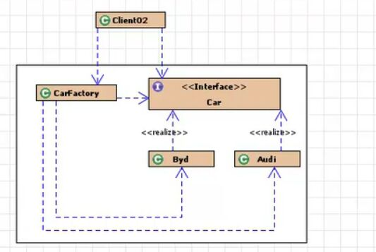
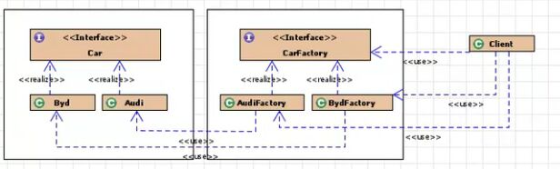
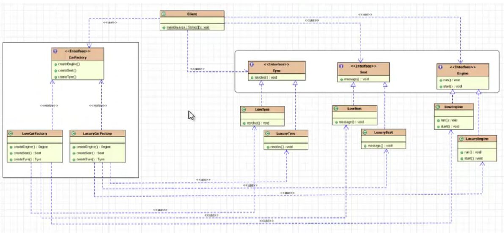

## 工厂模式
#### 1.作用
- 使创建者和调用这分离

#### 2.分类
- 简单工厂模式：生产统一结构中的任意产品
- 工厂方法模式：生产统一结构中的固定产品
- 抽象工厂模式：成产不同产品结构中的全部产品

#### 3.实现本质
- 用工厂里面的方法创建对象，从而把实现类和创建对象统一管理和控制


#### 原则：面向对象设计原则
- OCP：开闭原则，一个实体应该对扩展开放，对修改关闭
- DIP：依赖倒转原则，针对接口编程，不要针对实现编程
- LOD：迪米特法则，只和直接的朋友通信，避免和陌生人通信


### 简单工厂模式
```
也叫 静态工厂模式 ，工厂类一般是使用的静态方法。通过传入的参数来返回相应的对象实例，缺点是无法扩展，不能满足OCP原则
```
类图如下：



```
直接根据汽车接口类，实现一个汽车工厂，再由这个汽车工厂生产奥迪和比亚迪的实例
```

### 工厂方法模式
```
该模式有一组实现了相同接口的工厂类
```
类图如下：



```
如图可见，通过汽车工厂接口实现了奥迪车的工厂和比亚迪的工厂类2个相同接口的工厂类，再通过这两个工厂类，实现了奥迪车和比亚迪车的实例
```

### 抽象工厂模式
```
是两种模式的升级，适用于有多个业务品种和类别时
```


```
图片不太清楚，具体看代码
```