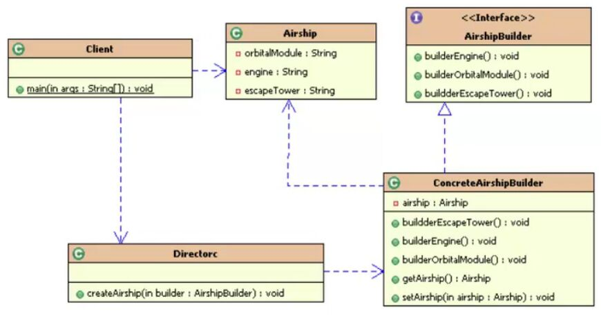

## 建造者模式

#### 建造者模式的出现
> 在实际构建对象时，过程往往非常复杂，有许多子组件，需要许多步骤进行处理，从而出现了建造者模式

#### 本质
> 将对象的子组件单独进行 建造 和 装配。实现了构造和装配解耦，不同的构造器，相同的装配，可以产生不同的对像。相同的构造器，装配顺序不同，也可产生不同的对象。

#### 类图

> 客户端Client调用装配者Directorc，装备者再调用建造者ConcreteAirshipBuilder构建对应的组件，然后进行装配。Airship里面是建造所需的一些子组件

> 构建者模式往往需要和其他模式如工厂模式一起使用